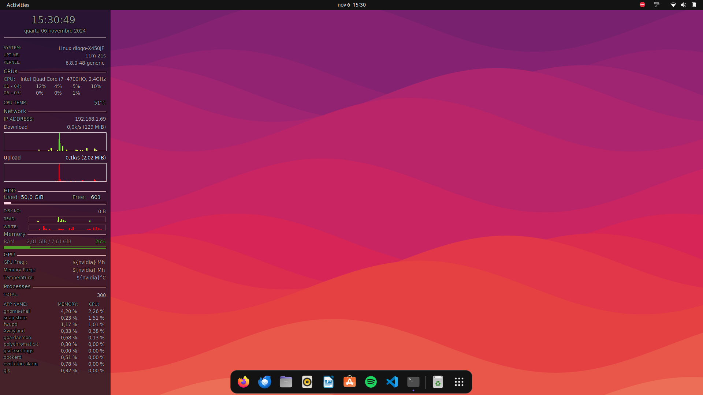

# Conky Configuration

## About Conky

**Conky** is a lightweight, highly configurable system monitor tool for X (Linux, BSD) that displays system information on your desktop. It can show various statistics, including CPU usage, RAM, disk usage, network speeds, and more. Originally developed as a fork of the `Torsmo` system monitor, Conky has since evolved into a highly customizable tool that users can tailor to their specific needs.

Conky is known for its flexibility: users can design their own configurations or apply community-shared ones to match their desktop aesthetics and functional needs.

How it currently looks:

